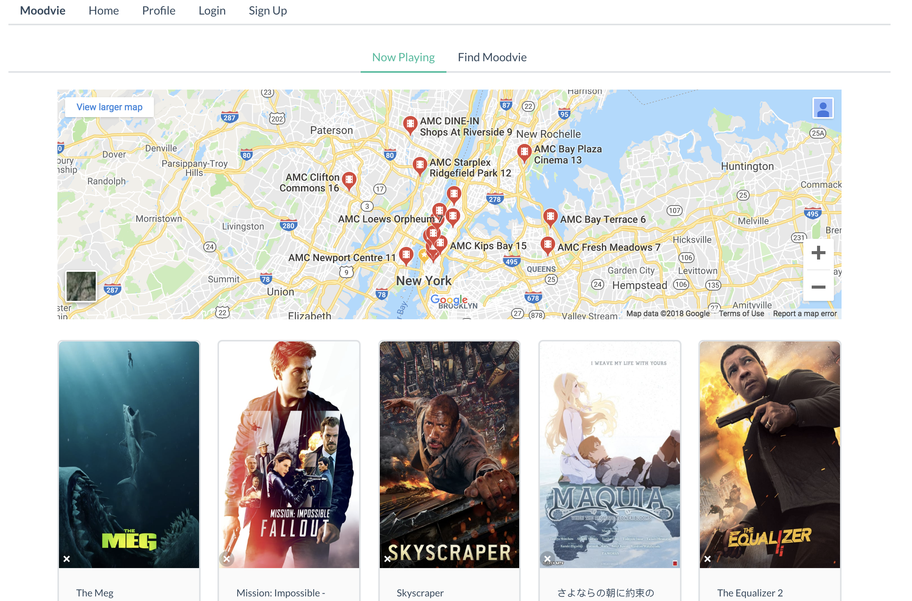
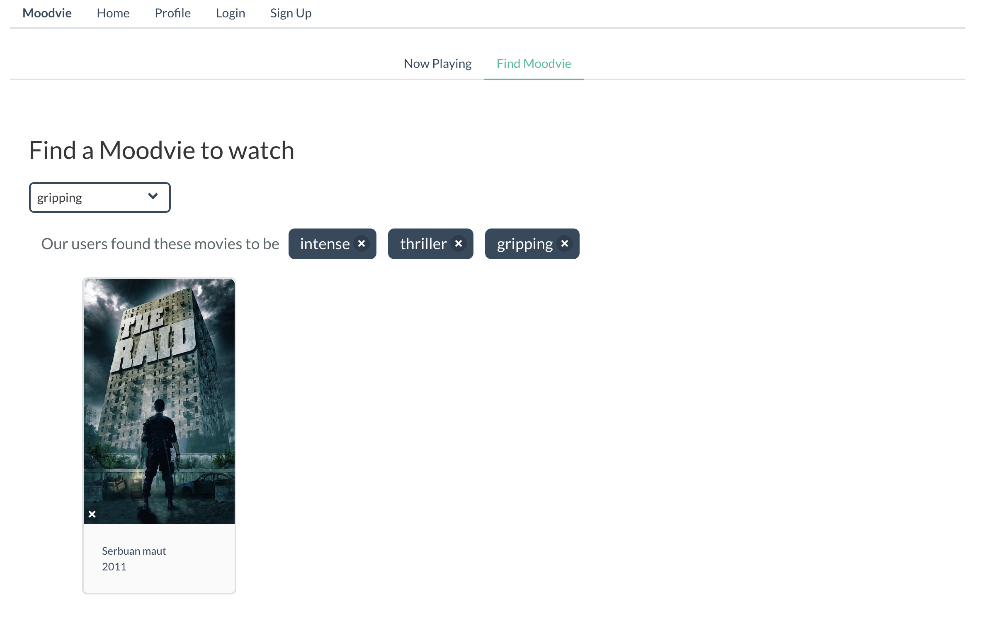
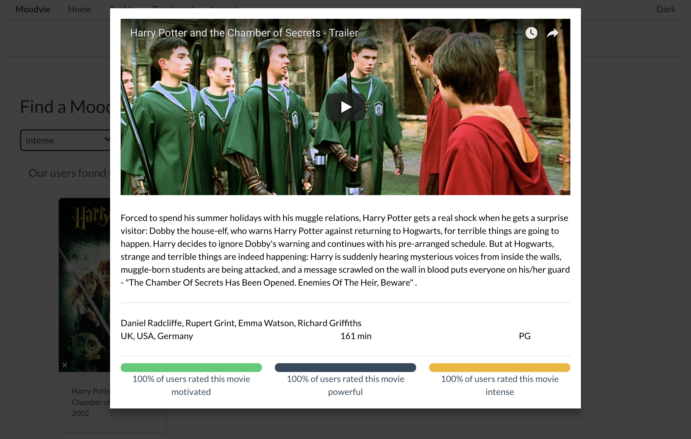
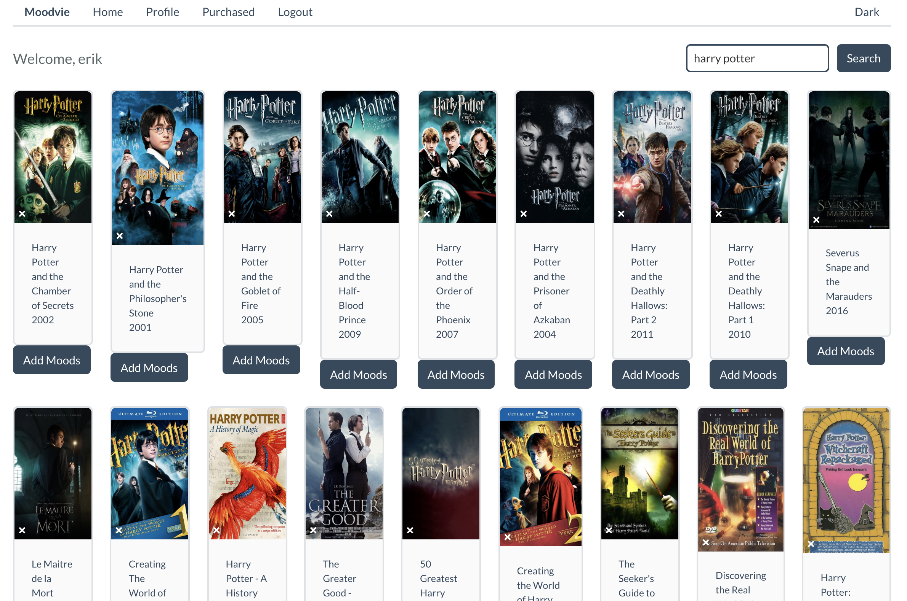
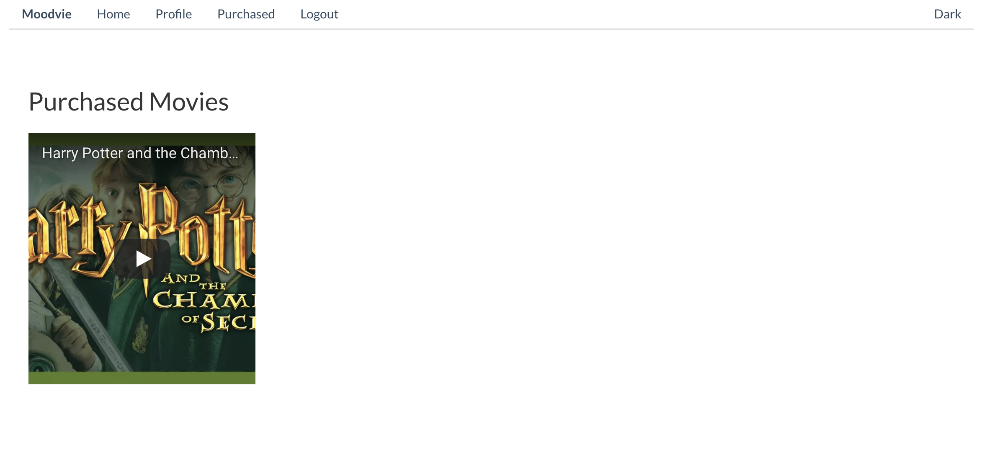

# Moodvie

An application that suggests movies based on user mood.

## Team

  - __Product Owner__: Roman Gorelik
  - __Scrum Master__: Erik Lin
  - __Development Team Members__: Jon Izak, Dan Guan

## Table of Contents

1. [Team](#team)
1. [Usage](#Usage)
1. [Requirements](#requirements)
1. [Development](#development)
    1. [Installing Dependencies](#installing-dependencies)
    1. [Tasks](#tasks)

## Usage



On initial page load, movies currently playing in theatres will render onto the page. A Google Maps component will display movie theatres in the area.



Users are able to search for movies based on their mood (Maximum of 3). These suggestions are created according to global user tagging of movies.



Modal with movie details, trailer, and breakdown of user tags will display on click.



Upon login or signup, users will be able to search for movies they wish to tag.



Users are currently able to purchase 'movies'. In actuality, only movie trailers are purchased.

## Development

### Core Tech Stack
React, React-Router, Node, Express, Mongoose

### Installing Dependencies
```sh
npm install
```
